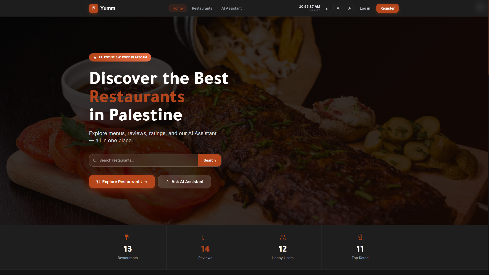
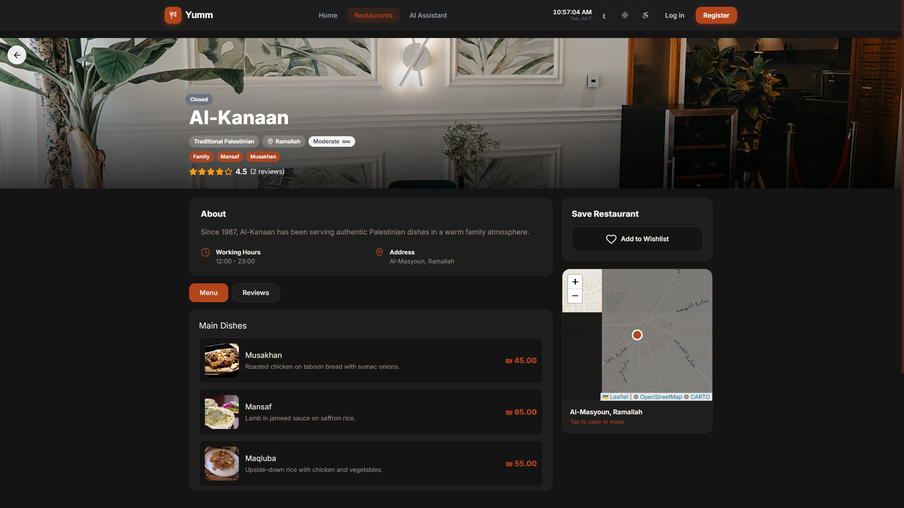
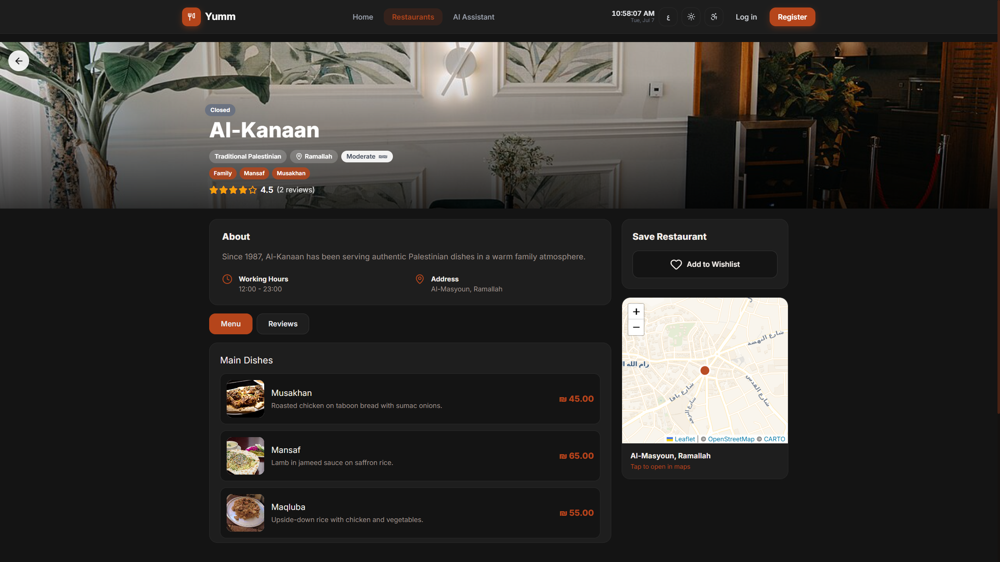
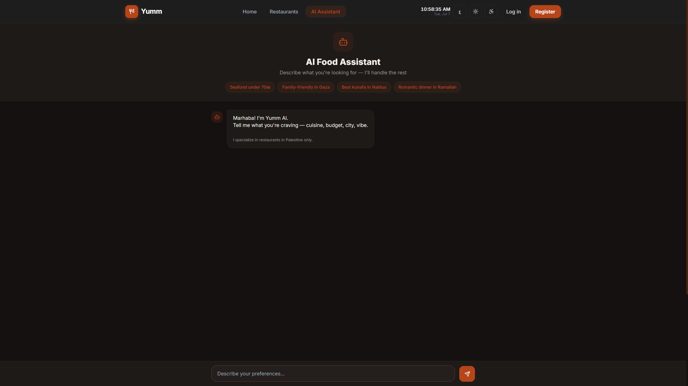
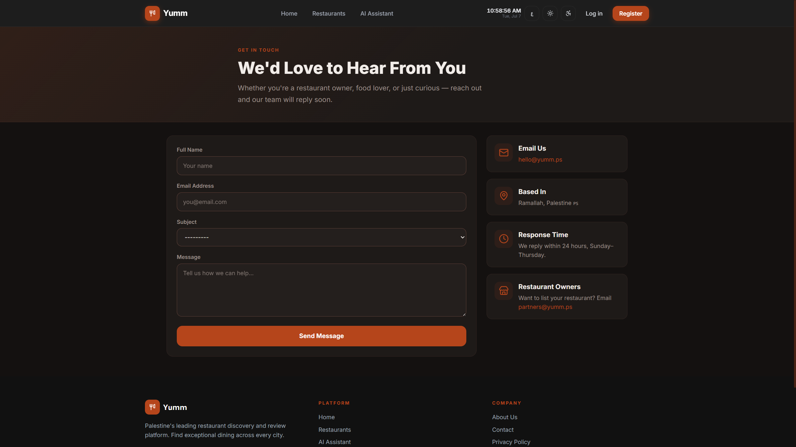

# Yumm

Yumm is a restaurant discovery and review platform for Palestine. People can browse restaurants, read and write reviews, save favourites, and get suggestions from an AI assistant. Restaurant owners manage their profile, menu, and reviews from a dedicated dashboard. Staff use the Django admin panel to approve listings and moderate content.

The site is bilingual (English and Arabic), works in light and dark mode, and includes an interactive map powered by Leaflet.

---

## Screenshots

### Home

Search, featured restaurants, and a quick path into the rest of the site.



### Restaurant directory

Browse by category or city, search by name, and explore restaurants on the map.



### Restaurant page

Menus, reviews, ratings, location map, and wishlist on a single page.



### AI assistant

Describe what you want — cuisine, budget, city, occasion — and get restaurant suggestions.



### Contact

Reach the team for support, partnerships, or general questions.



---

## What you can do

**As a visitor**

- Search and filter restaurants across Palestinian cities
- View menus, ratings, and reviews
- Save restaurants to a wishlist (requires an account)
- Switch between English and Arabic
- Use the AI assistant for personalised suggestions

**As a restaurant owner**

- Register and wait for admin approval
- Update restaurant info, hours, and location on a map
- Manage menu categories and dishes
- Read reviews and post owner replies

**As an admin**

- Approve restaurant owners and listings
- Manage users, restaurants, reviews, and contact messages
- Use the Jazzmin-themed admin interface at `/admin/`

---

## Tech stack

| Layer    | Tools                                              |
| -------- | -------------------------------------------------- |
| Backend  | Django 6, Django REST Framework                    |
| Database | MySQL (utf8mb4 for Arabic)                         |
| Admin    | django-jazzmin                                     |
| Frontend | Django templates, Tailwind CSS, vanilla JavaScript |
| Maps     | Leaflet + OpenStreetMap                            |
| i18n     | Django gettext (English / Arabic)                  |

---

## Project structure

```text
Yumm/
├── config/              # Settings, URLs, middleware, error pages
├── accounts/            # Users, auth, contact form, wishlist
├── restaurants/         # Public pages, owner dashboard, models
├── reviews/             # Ratings and comments
├── ai_bot/              # AI assistant UI and chat endpoint
├── templates/           # Shared site templates (home, about, errors)
├── static/              # Global CSS, JS, images
├── locale/              # Arabic translation builder
├── docs/screenshots/    # README screenshots
└── manage.py
```

---

## Main URLs

| URL                   | Description                   |
| --------------------- | ----------------------------- |
| `/`                   | Home page                     |
| `/restaurants/`       | Restaurant directory          |
| `/restaurants/<id>/`  | Restaurant detail             |
| `/ai/`                | AI assistant                  |
| `/accounts/register/` | Create an account             |
| `/accounts/login/`    | Log in                        |
| `/dashboard/`         | Owner dashboard (owners only) |
| `/admin/`             | Admin panel                   |
| `/contact/`           | Contact form                  |
| `/about/`             | About page                    |
